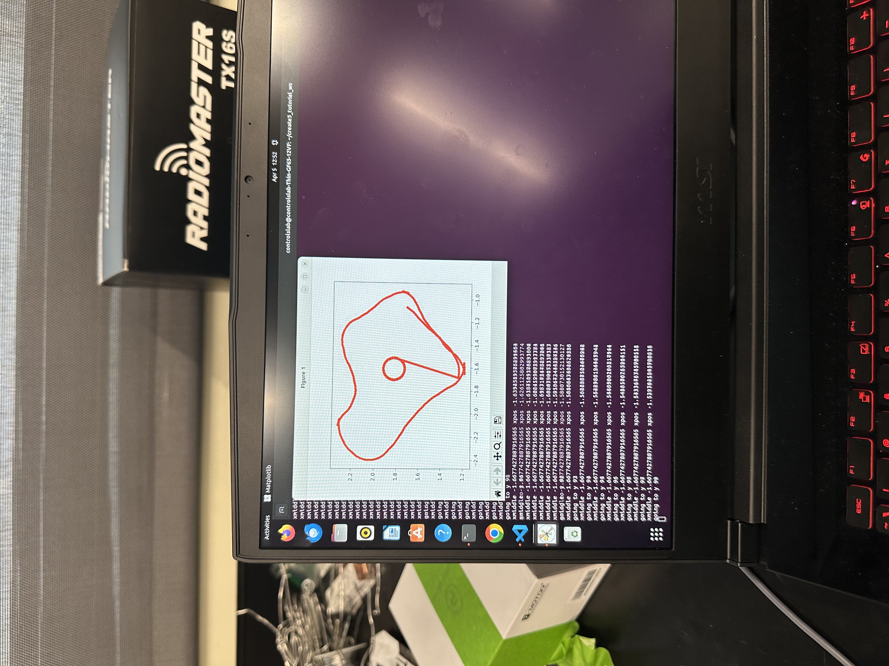

# ROS2-Mapping

This project makes use of ROS2 to have an iCreate3 robot map out any enclosed space and do a dance at the center of the mapped area. 
The project uses various publishers and subscribers as well as the following topics: IrIntensityVector, Twist, and Odometry. 
Nested if statements are created to have the robot map out a room using data from the IR sensors. Twist is used to allow the robot to rotate and move linearly. Odometry is used to locate the robots orientation with respect to its global coordinates. 

Here is an image of the mapping and a video of the robot mapping:
https://youtube.com/shorts/5hRk7LOxFXQ?si=46OjptZYGUCOCu3B

Path to mapping code: ROS2-Mapping/Ros2_Midterm/src/Ros2_Midterm/Ros2_Midterm/map_pub.py .
This code contains comments to explain the code. 
